# Big-Data-Course

# Graphs

In the first graph you can see the Linear Regression between Salary and experience. It's obvious that they are both related to each other, the more you already have worked the more salary you get.

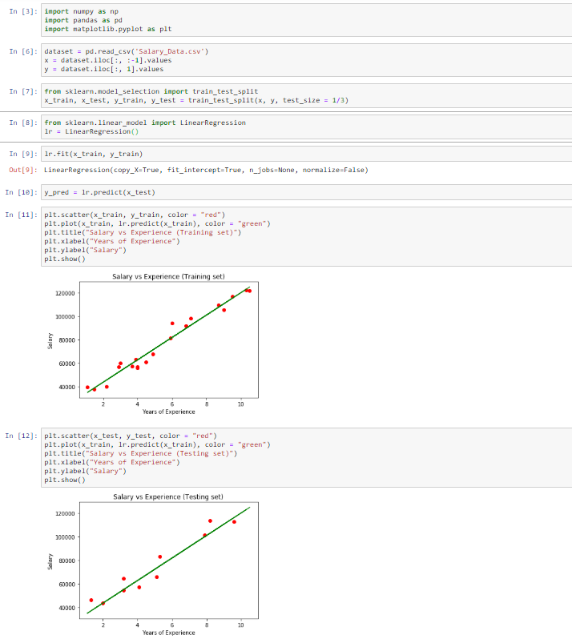

In the second graph I will show you the correlation for the topic suicide, I made an heatmap to see the correlation between the ages and that GDP or the HDI makes a difference.

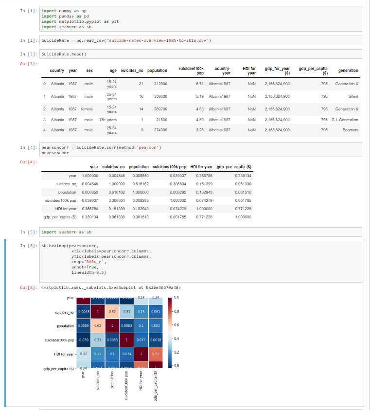

# Car recognizing

Als autohandelaar zijnde als student-ondernemer ben ik op het idee gekomen om een autoherkenningsprogramma te schrijven. Ik ben begonnen met een dataset te maken. Ik had al zelf veel bruikbare data aan de hand van al verkochte auto's, ik kwam uiteraard nog vele foto's te kort dus ben ik begonnen met foto's van Flickr.com en Unsplash.com. Na vele downloads verder en wat gecodeerd te hebben besloot ik dat deze dataset die ik zelf gemaakt had onvoldoende was om hiermee verder te gaan. Na wat google verder kwam ik op deze dataset terecht : https://ai.stanford.edu/~jkrause/cars/car_dataset.htm.
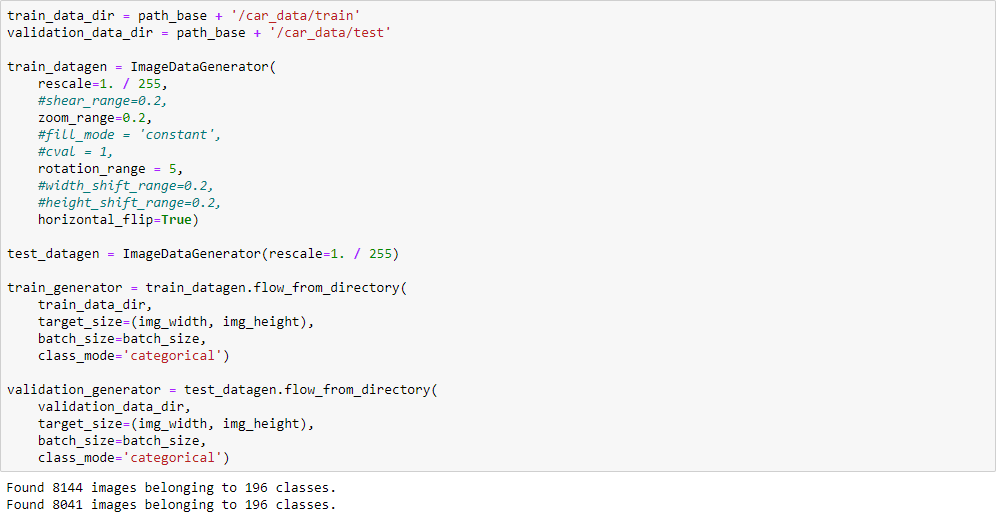

Dit is een ruwe dataset met pure foto's, na deze gebruikt te hebben kwam ik uiteraard op de fout dat deze nog moest onderverdeeld worden in de klassen en categorieën.

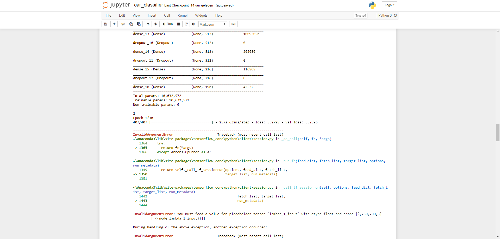

Na wat verder gezocht te hebben was er al iemand die deze onderverdeeld had : 
https://www.kaggle.com/jutrera/stanford-car-dataset-by-classes-folder. 
Nu gebruik ik deze en dit zijn de resultaten :

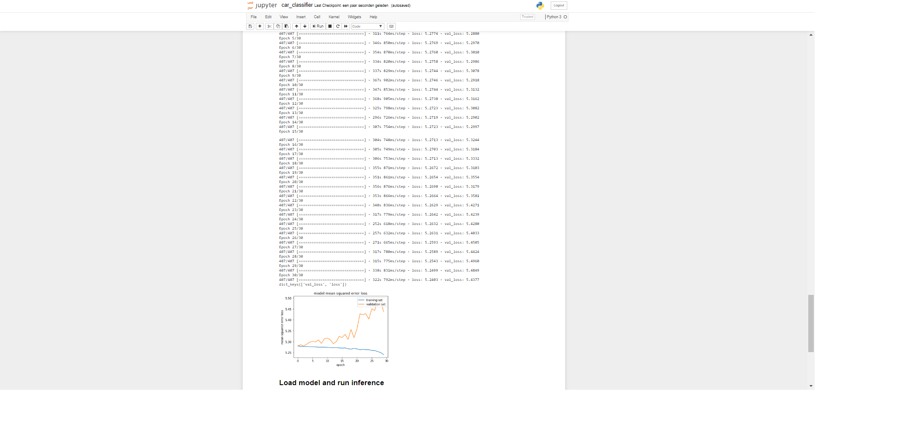

Het programma begint met alle libraries te importeren die ik nodig heb.

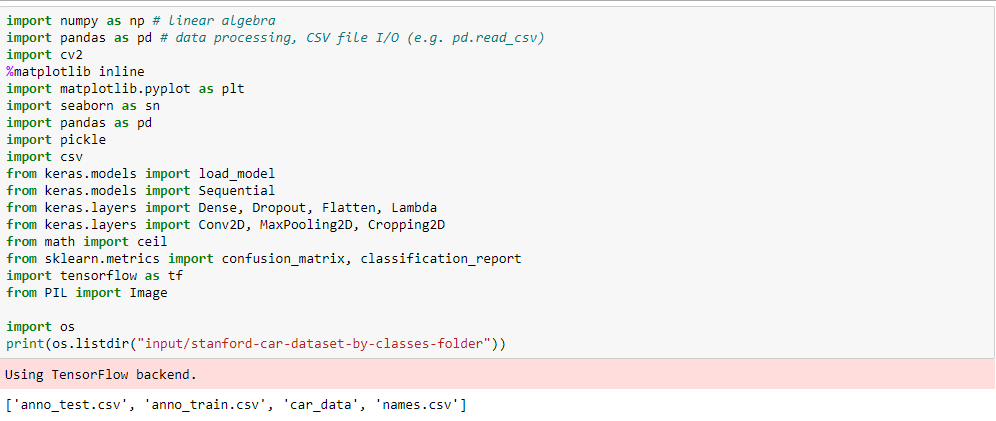

Daarna controleer ik of hij de juiste directory wel vind.

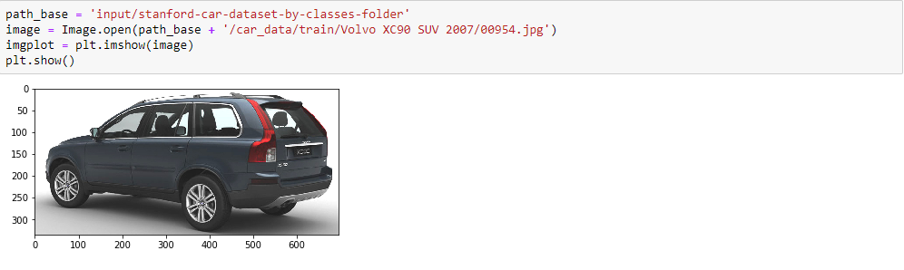

Daarna worden de klassen ingelezen, dus per voertuig de klasnamen en het merk.

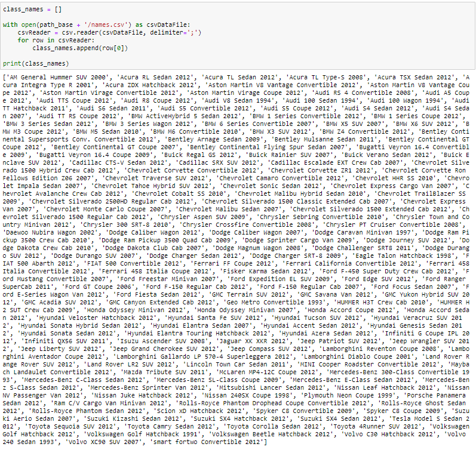

Daarna importeren we de Keras libraries verder

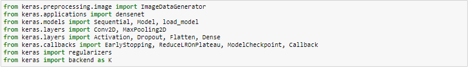

Daarna zetten we de parameters voor het model klaar, alsook word getest of ik in de juiste directory zit door de images die geteld worden samen met de klassen.

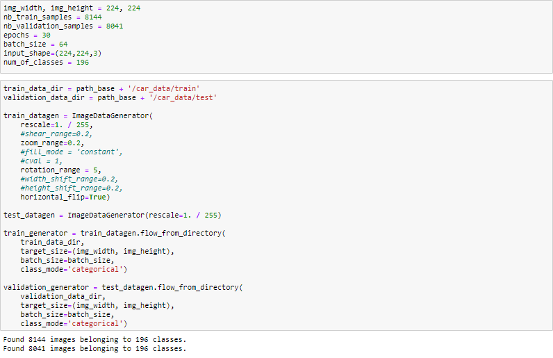

Na dat de parameters zijn gedeclareerd maken we de methode om het model te maken.

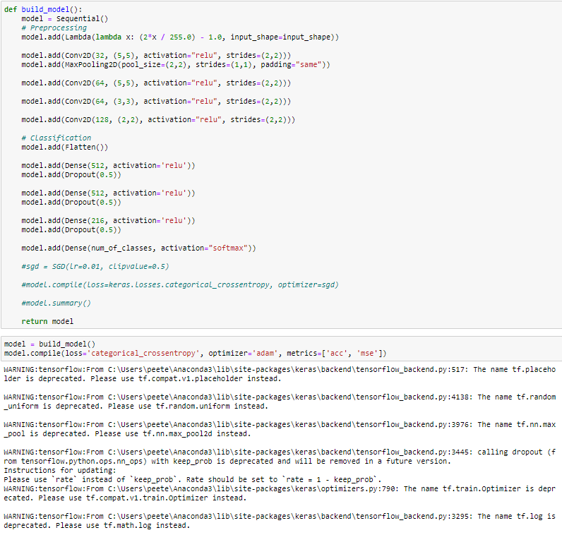

Hiermee begint het model met trainen.

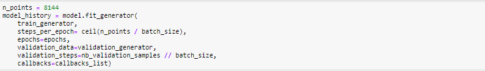

Dit zijn de resultaten van de training. Zoals je kan zien zijn de resultaten zeer laag omdat ik een lage batch_size heb gekozen. Hoe groter de batch size des te meer accuracy maar hoe langer de training ook duurt.

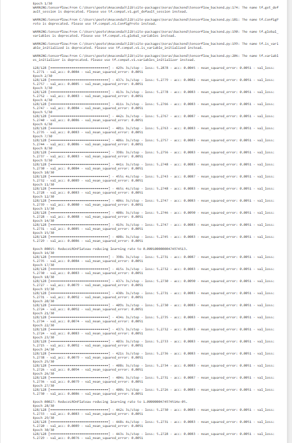

Nadat het model is gerund laat ik de resultaten plotten in een grafiek, dit is het resultaat, zoals je kan zien is er wel enige samenhang. Zoals je kan zien is de accuracy wisselvallend en is hier geen vast percentage op te stellen, dit verwisselt nogal.
Je kan zien dat hij meer verlies heeft bij de training dan bij validation.

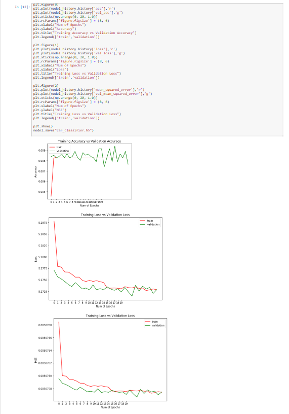

Dit is het eindresultaat, zoals je kan zien zijn ze niet zoals verwacht. Het is zo goed als altijd fout. Hij neemt altijd willekeurige foto's terwijl ik hem run, de foutmelding is een probleem dat er spijtig genoeg niet genoeg RAM beschikbaar is.

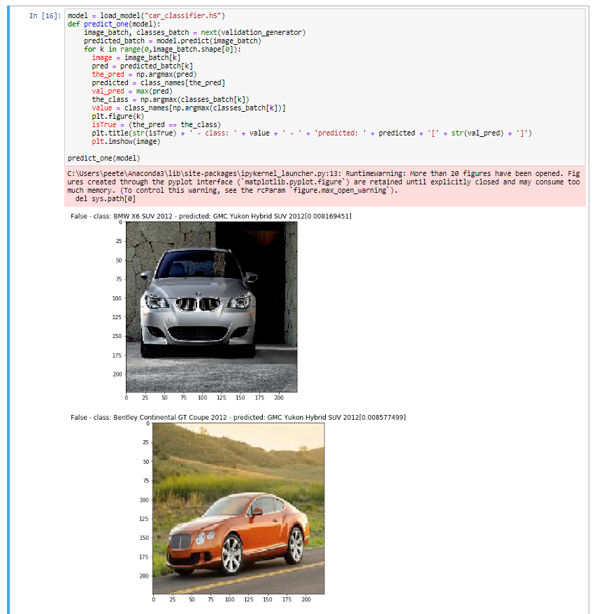

# Extra

Dit was een test, heb deze maar even laten runnen omdat deze te groot en teveel lagen gebruikte. Dit betekent uiteraard wel meer nauwkeurigheid, dit is ook een andere en een iets meer geavanceerdere techniek tegenover diegene die ik nu op het einde gebruik. Dit verschil zit puur in de code van het model te creëren. De techniek heet transfer learning, deze techniek is beter dan de techniek die ik nu gebruik als het om ongeveer dezelfde taken zouden zijn dus niet echt specifiek maar eerder generiek, door de mindere lagen hebben we wel meer kans op overfitting dit betekent dat er te weinig lagen gekent zijn om het juiste resultaat te kunnen geven.

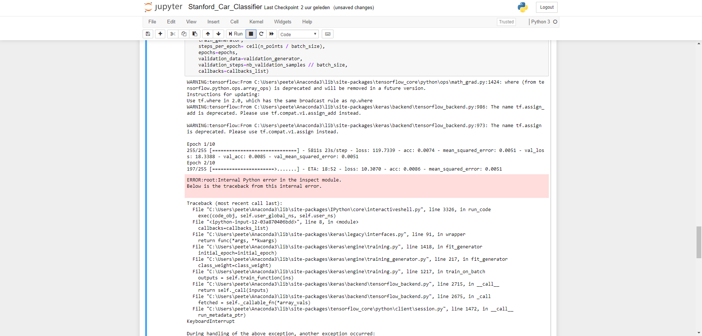
