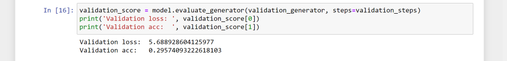

# Project Car classifier

1. Started to find a dataset, first I tried to find a dataset by myself. Tried to find all the pics by myself. As a Used car dealer I thought I had enough pictures just by my own library
but that wasn't enough. After some searching and downloading pictures itself I found this dataset on the ethernet : 
https://ai.stanford.edu/~jkrause/cars/car_dataset.html

2. It were all random pictures so I kept searching on a dataset where someone already mapped the photo's. I found one on Kaggle.com : 
https://www.kaggle.com/jutrera/stanford-car-dataset-by-classes-folder

3. I tried to make a car classifier in Jupyter notebook with Keras. Tried multiple times with other Epochs and different Batch sizes but the conclusion was that Keras wasn't good in my situation because you can only get it to work with your GPU if you are a  Nvidia Developer. Training the model took between the 24 hours and the 36 hours : 

4. Here you can see the results of a small 25h hours of training. Not such good results with Keras.

Then I reversed it, Less epochs and bigger Batch sizes means better results. : 

5. Still not the results I hoped for and tried another model. Instead with Keras I went with PyTorch. PyTorch was able to work with my gpu which was heaven on earth compared to keras who always took multiple hours of my CPU running 100%. It's now with a pre trained model called Resnet34. It works with PyTorch. Now with the help of my GPU the epochs only take a couple of minutes instead of almost an hour.
These are the results : 

These are the graphs and statistics of the results from the model : 

Prediction of this beautiful Volkswagen Beetle : 

Prediction of this sports car : 

6. The Beetle is 100% right. The Ferrari is not fully wrong. The Ferrari on the photo that I took by myself and used is the newer Model. A Ferrari 488.
Now I picked a tricky car. A car that is actually the same car as another one but just with a different badge. It's a car that I sold recently. An Abarth 595 who shares it's chassis with the normal Fiat 500. Only difference are the badges and another engine. As you can see I took the picture from the side to trick the model but he has it semi-right because he took the fiat.

# Number plate detector

After the car classifier I wanted to try something else with cars. I found a pre trained model called YOLO (https://pjreddie.com/darknet/yolo/). With Yolo it would be possible to let the model check if there would be a number plate or not. At my home we installed a new camera system recently and because of security reasons I was thinking about using number plate recognition. But it wasn't possible with just a normal camera only with a ANPR camera but that comes with a heavy price tag (around €700). Now I wanted to try to make it myself and first I tried it on my own pictures to see what would happen. I got so far that I can detect them from a picture but I can't read them. These are the results : 

Picture from the front, easy to see

Picture bit more difficult from the side

Picture from a custom number plate

When there is no number plate he says nothing and also doesn't leave a marking on the photo

# Object detector

1. Videos
As I said earlier we recently installed a new camera system. There is already motion detection in the camera's built in. I would maybe like to go a step further and install some other detection in. Like detection and counting of cars so I can see what is where going on. Counting cars on the parking lot or count who many people are in. But first before I start or maybe try to do that I'm gonna start with the detection of the camera's. My first example is footage of the camera who hangs outside to see a couple of my own cars who are parked up front. As you can see it's a small video of 10 seconds where you can see that he detects my own cars that are parked and the 2 cars that are driving by. In those small 10 seconds there were more than 311 frames. To let the model see the video takes a small 15 minutes. 

Before:
https://youtu.be/iLS4YvHryQA

After : 
https://www.youtube.com/watch?v=k4OpxJY5OCw&feature=youtu.be

2. Images 

With object detection I used Yolo again because I already had some experience with it. I also found a tutorial online who would help me with it. As you can see the pre trained model even detects animals, cars humans. It's perfect for the security reason I've picked it. Here are some results : 

