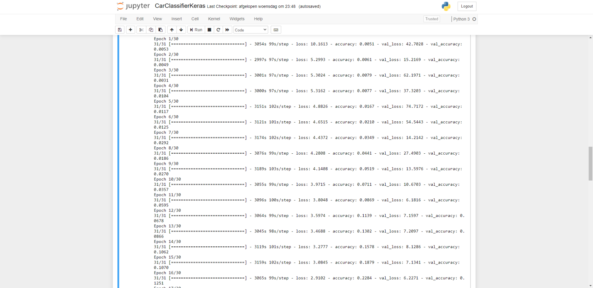
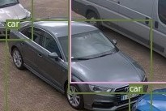
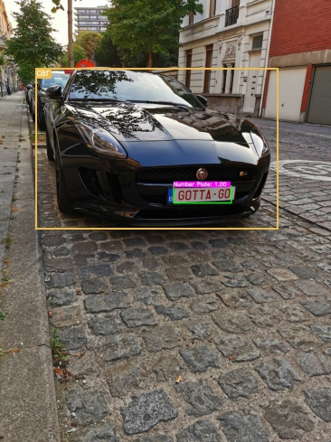
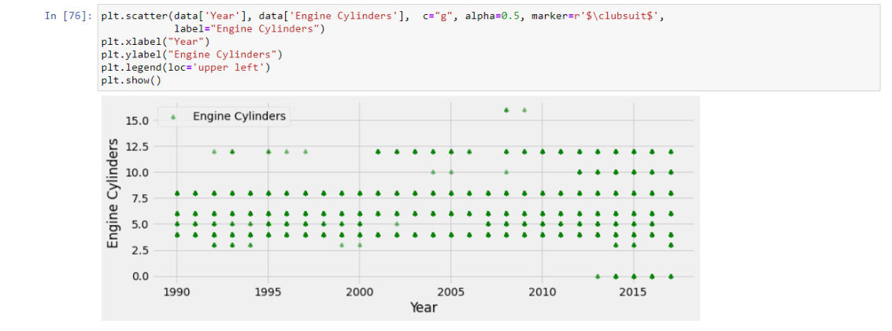

# Project Car classifier

1. First I tried to find a dataset by myself. Tried to find all the pics by myself. As a Used car dealer I thought I had enough pictures from my own experience
but that wasn't the case. After searching for some pictures I found this dataset on the ethernet : 
https://ai.stanford.edu/~jkrause/cars/car_dataset.html

2. It were all random pictures so I kept searching on a dataset where someone had already classified the pictures. I found one on Kaggle.com : 
https://www.kaggle.com/jutrera/stanford-car-dataset-by-classes-folder

3. I tried to make a car classifier in Jupyter notebook with Keras.I tried multiple times with other Epochs and different Batch sizes but the conclusion was that Keras wasn't good in my situation because you can only get it to work with your GPU if you are a  Nvidia Developer. Training the model took between  24  and  36 hours : 

4. Here you can see the results of a small 25h hours of training. Not such good results with Keras.

Then I reversed it, Less epochs and bigger Batch sizes means better results. : 

5. I still did not get the results I hoped for and tried another model. Instead with Keras I went with PyTorch. PyTorch was able to work with my gpu which was heaven on earth compared to keras who always took multiple hours of my CPU running 100%. It's now with a pre trained model called Resnet34. It works with PyTorch. Now with the help of my GPU the epochs only take a couple of minutes instead of almost an hour.
These are the results : 

These are the graphs and statistics of the results from the model : 

Prediction of this beautiful Volkswagen Beetle : 

Prediction of this sports car : 

6. The Beetle is 100% right. The Ferrari is not fully wrong. The Ferrari on the photo that I took by myself and used is the newer Model. A Ferrari 488.
Now I picked a tricky car. A car that is actually the same car as another one but just with a different badge. It's a car that I sold recently. An Abarth 595 who shares it's chassis with the normal Fiat 500. Only difference are the badges and another engine. As you can see I took the picture from the side to trick the model but he has it semi-right because he took the fiat.

# Number plate detector

After the car classifier I wanted to try something else with cars. I found a pre trained model called YOLO (https://pjreddie.com/darknet/yolo/). With Yolo it would be possible to let the model check if there would be a number plate or not. At my home we installed a new camera system recently and because of security reasons I was thinking about using number plate recognition. But it wasn't possible with just a normal camera only with a ANPR camera but that comes with a heavy price tag (around €700). Now I wanted to try to make it myself and first I tried it on my own pictures to see what would happen. I got so far that I can detect them from a picture but I can't read them. These are the results : 

Picture from the front, easy to see

Picture bit more difficult from the side

Picture from a custom number plate

When there is no number plate he says nothing and also doesn't leave a marking on the photo

# Object detector

1. Videos

As I said earlier we recently installed a new camera system. There is already motion detection in the camera's built in. I would maybe like to go a step further and install some other detection in. Like detection and counting of cars so I can see what is where going on. Counting cars on the parking lot or count who many people are in. But first before I start or maybe try to do that I'm gonna start with the detection of the camera's. My first example is footage of the camera who hangs outside to see a couple of my own cars who are parked up front. As you can see it's a small video of 10 seconds where you can see that he detects my own cars that are parked and the 2 cars that are driving by. In those small 10 seconds there were more than 311 frames. To let the model see the video takes a small 15 minutes. 

Before:
https://youtu.be/iLS4YvHryQA

After : 
https://www.youtube.com/watch?v=k4OpxJY5OCw&feature=youtu.be

2. Images 

With object detection I used Yolo again because I already had some experience with it. I also found a tutorial online who would help me with it. As you can see the pre trained model even detects animals, cars humans. It's perfect for the security reason I've picked it. Here are some results : 

This is a picture the camera took when he tracked some motion. As you can see it tracks even more than i thought : 

# Combining the projects

I wanted to try if it would be possible to combine the projects with eachother and let the computer decide everything. I tried it first with my own footage from the camera's but they were to far away or the quality wasn't good enough. The problem with the object classifier is that it makes the quality worser from the picture : 

Original Photo : 

Detected Photo : 

Now trying the number plate :

Orig : 

Detected Photo : 

As you can see on the pictures they look trimmed down in quality. When it are clear pictures like the one that I have used before it isn't a problem but when it's already from a distance with only a 5mp camera it's not usable. 

When I take HQ pictures from the ethernet doesn't mean it has a 100% rate. From the 3 pictures that I took only this one worked : 

After some testing of the number plate detector the biggest reason why he couldn't detecte the number plate is because it's from a difficult angle to recognize it and when I first use Car detector it's more difficult for the number plate detector to detect it. So know we now that our Number plate detector is our weakest point because the car detector does almost work everytime.

Here are some other examples where you can see that the number plate is good readable and easy to predict : 

Now I'm going to combine my 3 projects. First I'm gonna let the car classifier predict what kind of car it is : 

It predicted it right, a Volkswagen Beetle from 2012. Now we are gonna predict if he has a number plate or not and where it is located on the picture : 

His prediction is right, he has a number plate. After the prediction of the number plate now we are gonna check object itself. Maybe there are even other objects in the picture like we have seen before on the other pictures that I used : 

This is another example. First I ran the image through the car classifier as you can see he predicted it right : It's a Mercedes SL Series 

After I ran it through the classifier I wanted to try the car detector first because the image was from good quality so it would be possible to first through the image detector instead of the number plate : 

As you can see both were detected right. It was a good frontal picture of the car, the image loss the detection gave wasn't a problem at all.

# Statistics

For statistics I've picked multiple subjects and the first subject that I'm going to show you are graphs from a dataset that I found online that has all the info over cars.
From MPG to MSRP etc : 

1. Car MSRP through the years
https://www.kaggle.com/CooperUnion/cardataset

In the first photo I'm going to show you the top 5 rows from the dataset so you can see how the data can be interpreted : 

The data has 12000 records that's big enough to have a nice average.

First I'm going to show you the years. As you can see on the graph most of the records that are in this dataset are from 2015 until 2017 because the dataset doesn't have the last recent models. The reason why it has a peak in the last years is because this dataset does have more records from 2010-2017 against 1990-1995.

On this graph I show you what kind of power the cars have. You can see that the most range of the cars are in the 100 HP ) 300 HP range. In Belgium it would have a very different result. In Belgium most of the cars have around the 100-180hp. It's rare to even have more than that, most of the cars that are selling right now in Belgium doesn't even have the 100hp because of all the emission rules and the taxes everybody wants to drive a small engine to evade taxes. 

I made this graph because I was curious about how the difference in HP would be with the older cars vs the newer cars. As you can see it's a trend to go more and more HP. The higher the better. The standard of today is higher than the standard of 1992. 

Now we have the cylinders. Something technical about an engine. Engines have multiple cylinders. You can see it as workers in a business. The more cylinders the bigger the engine. As you can see almost everything is defined into 4,6, 8 and sporadically a 10 and maybe a 12. The dataset is American market because in Europe there would be a huge difference. In 2012 Europe began with their climate rules. Car makers have to follow the rules, engines need to be smaller, low emissions. Hybrid and electric. Change to less cylinders so less emissions... If the graph would be in Belgium there would be almost no 8,10 or 12. Here even 6 is rare. 3 and 4 are most common nowadays.

Here you can see the cylinders per year. As you can see there are already a couple 3 cylinders in the dataset. As you can see they even began making even bigger engines like the W16 who is in the Bugattiv Veyron. He produces around the 1000hp. The results are almost the same in the early 90's then in the 2010's.

I also plotted the distribution of what kind of cars are in the dataset because there was no class for what kind of vehicle I choose the door option. Normally in Belgium we say we have a 5 door or a 4 door but that's depending on how the trunk is with the seats.

If a car has 2 doors it's probably a coupe,
whereas if a car has 4 doors it's probably a SUV or a sedan

On this graph you can see the prices compared to the early 1990's until 2017. You can see how horsepower influences the price compared to the cars with lower horsepower. 
You can see how more cylinders influences the price of the car. That because of inflation the car price gets higher and higher on average compared to a couple years earlier.
How lesser the MPG from the cars how more expensive they are. That's cohesion with the more cylinders and more horsepower. How higher the horsepower/cylinders the less MPG you will get on the highway and the city. Doors and MSRP isn't really relevant because you can have an expensive 4 door sedan and a very cheap one. Same with a cheap VW Polo and an expensive Lamborghini Gallardo.

On these graphs it's more about the small details that aren't really defined to make a car cheaper or maybe even more expensive. 
I's from on what fuel type does the car drive and what kind of transmission does the car have but that's already self explanatory I guess.
The reason why a rear driven car is more expensive is because of the technology and that a rear driven car is most of the time a sports car the reason why they are more expensive than a front wheel driven car. The last 5 years it has become a sport to make your luxury sports sedan an all wheel driven car or a four wheel driven car. It's the same.

2. Car MPG (Miles per gallon)

I found this dataset on kaggle, because all my subjects are with cars I would like to go through with that subject.
This dataset is about the emissions and the MPG of all the modern cars and what can affect your MPG.

First I'm going to show you how the data looks like : 

This dataset is full of records from people who measured their outside temp, inside temp, average speed etc. Everything that can affect your MPG.
The weather outside is also a big influence of your MPG. If the sun shines or what kind of gas your car runs on.

This is the greatest factor of your MPG. The speed of your car. Also your car is very important but you can't change your car just for only the MPG (theoretically now). This is to show how you can be more efficient with your MPG. On this graph you can see how slower the car goes the more L per 100km. Why is there such a big difference and now cohesion with the speed? It all changes with the gears and the traffic and maybe even the outside condition.

This graph shows that's is also very important on what kind of distance you rode. When a diesel engine is not even fully warm or your driving not far enough your consumption is going to horrible compared to a ride with a petrol or a couple kilometers further. It absolutely depends on how the driver rode.

This graph shows what the consumption is with the temperatures.

On this graph I show if there is any difference when you use the heating of your car or not. As you can see when the heating is on your consumption is going up. 
There are 2 reasons : Heating costs power of your car 
                      Heating means the conditions on the outside aren't ideal for your car as the same on the road, that's why.

This graph shows the consumption when you are driving with or without the airconditioning on. 
Most of the people say when your AC is on in your car he uses more gas. That's true but now you are asking why says the graph something different?
Because when you use your AC it's probably 25+ degrees Celsius. That means the ideal driving condition for your car. No rain, less traffic and better weather.
So that bit extra your AC consumes isn't compared to the consumption of bad driving conditions.

This graph reflects your consummation of your car when you are driving and it starts raining compared to when it's not raining.
The graph shows that your consummation is a lot higher when it's raining compared to when it's not.
There are a couple reasons for : When it starts raining people are more hesitating in traffic and that means more traffic and higher consumption.
                                 Rain means more resistance for your car. More resistance means higher consumption.
                                 When it rains it's more likely you are putting the heater on and the heater means higher consumption

On this graph we can see the difference between no sun and when the sun shines. You can see it's a big difference for just a small factor you would think.
There a couple reasons why it's such a difference : When the sun shines it isn't raining and traffic goes smoother compared to rain.
                                                    When the sun shines you don't use much electronics of your car so less usage of the power of your car.
                                                    When the sun shines it are perfect driving conditions for your car.

This correlation plot shows what has the biggest cohesion with each other. 

